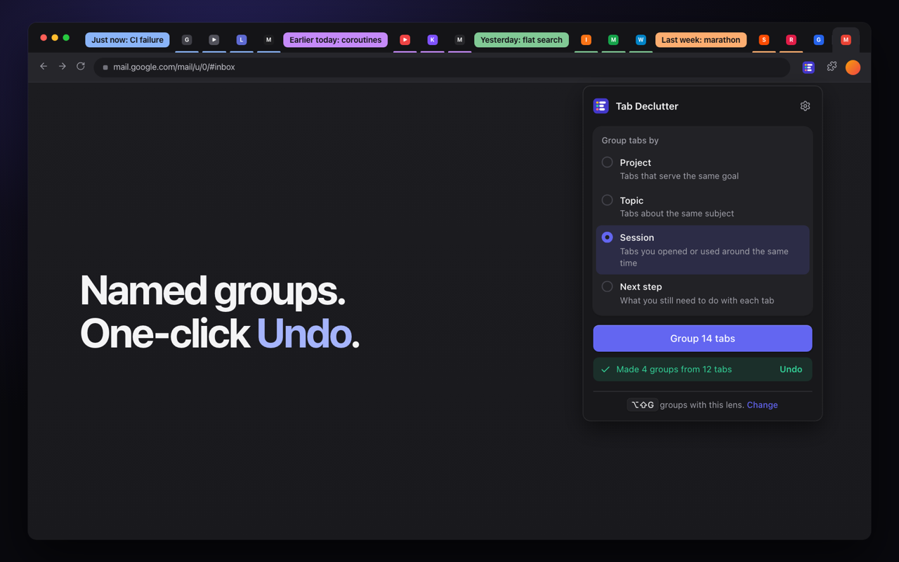

<p align="center">
  
</p>

<h1 align="center">Tab Declutter</h1>

<p align="center"><strong>AI tab groups for Chrome, with your own API key.</strong></p>

<p align="center">
  <a href="https://github.com/iurysza/tab-declutter/releases/latest"></a>
  
  
</p>

<p align="center">
  
</p>

Tab Declutter sorts the tabs in your current Chrome window into named tab groups. It asks the AI provider you choose, using your own API key. Pick a lens, click once, and undo in one click if you don't like the result.

## What it does

Tab groups only help when someone names and maintains them. Tab Declutter does that work when you ask. It never runs in the background and never touches other windows.

Choose a **lens** to decide what "belongs together" means:

| Lens | Groups tabs by | Example group names |
| --- | --- | --- |
| **Project** (default) | the goal they serve, across sites | "Fix login redirect", "Find a flat" |
| **Topic** | the subject they are about | "Kotlin coroutines", "Berlin flats" |
| **Session** | when you opened or last used them | "Just now: CI failure", "Yesterday: flat search" |
| **Next step** | what you still need to do | "Act now", "Read later", "Reference", "Probably done" |

You can also write your own lens in Settings.

- **Undo** restores the previous order, groups, names, colors, and collapsed state for tabs that still exist.
- **Keyboard shortcut:** press <kbd>Alt</kbd>+<kbd>Shift</kbd>+<kbd>G</kbd> (<kbd>⌥⇧G</kbd> on macOS) to group with your last-used lens without opening the popup. The toolbar badge shows progress and the number of groups made. Change the shortcut at `chrome://extensions/shortcuts`.
- Pinned and split-view tabs stay where they are. Tabs that don't clearly fit stay ungrouped.

## Install

Tab Declutter is on the Chrome Web Store. To install a release by hand instead:

1. Download `tab-declutter-v0.2.0.zip` from the [latest release](https://github.com/iurysza/tab-declutter/releases/latest).
2. Unzip it.
3. Open `chrome://extensions`.
4. Turn on **Developer mode**.
5. Select **Load unpacked** and choose the unzipped folder.

Requires Chrome 140 or newer.

### Build from source

```sh
git clone https://github.com/iurysza/tab-declutter.git
cd tab-declutter
bun install --frozen-lockfile
bun run build
```

Load the generated `dist/` folder from `chrome://extensions`.

## Connect a provider

1. Open Tab Declutter **Settings**.
2. Choose a provider, then enter the exact model ID and your API key.
3. For an OpenAI-compatible service, add its base URL.
4. Select **Save settings** and allow access to that provider when Chrome asks.
5. Open the popup, pick a lens, and select **Group N tabs**.

| Provider | You need |
| --- | --- |
| OpenAI | API key and model ID |
| Anthropic | API key and model ID |
| Google Generative AI | API key and model ID |
| OpenAI-compatible | API key, model ID, and base URL |

Custom endpoints must use HTTPS. `localhost`, `127.0.0.1`, and `[::1]` may use HTTP for development.

## Privacy

Tab Declutter has no account, backend, analytics, or telemetry. It uses no content scripts. Requests go straight from your browser to the provider you chose.

A grouping request sends:

- the lens name and instruction;
- each eligible tab's title and URL, with credentials, query strings, fragments, and local file paths removed;
- a temporary reference such as `T1` instead of Chrome's tab ID;
- for the **Session** lens only: a rounded time since each tab was last used, such as "25 min ago", and which tab opened it, as a `T` reference.

Tab Declutter never reads page contents, browsing history, bookmarks, cookies, or form data.

Your API key stays in `chrome.storage.local` in this Chrome profile. It is only sent to your provider to authenticate. The Undo snapshot stays in `chrome.storage.session`. Chrome asks for provider access only when you select **Save settings**.

Permissions:

- `tabs` reads and organizes tabs in the active window.
- `tabGroups` creates, names, and restores groups.
- `storage` keeps settings and one Undo snapshot.

Read the full [privacy policy](docs/privacy.md).

## How grouping stays safe

Tab titles and URLs are treated as untrusted data. The model's answer is checked against a schema before any tab moves. Unknown references, duplicate assignments, blank names, and one-tab groups are dropped.

Before the first change, Tab Declutter saves the current layout. If grouping fails partway through, it restores that layout. If restoring also fails, the snapshot stays available through Undo.

## Try it without a key

Run the local OpenAI-compatible fixture:

```sh
bun run mock:provider
```

In Settings, choose **OpenAI-compatible**, use the printed base URL, set the model to `tab-declutter-fixture`, and enter any non-empty key. The fixture groups `T1` and `T2` as **Fixture workstream**.

## Development

Requires Bun 1.1.34 or newer.

```sh
bun install --frozen-lockfile
bun run dev
bun run check
```

`bun run check` runs strict TypeScript, Oxlint, the tests, the production build, and the project contract check.

Domain logic in `src/domain/` has no Chrome dependency. Use cases in `src/application/` depend on ports and are tested with in-memory fakes. Chrome, storage, and AI SDK calls live in `src/adapters/`. Read the [architecture guide](ai-artifacts/architecture/README.md) for the full map.

Store images are generated from the real UI with `store-assets/generate.sh`.

## Documentation

- [Architecture guide](ai-artifacts/architecture/README.md)
- [Privacy policy](docs/privacy.md)
- [Chrome Web Store publishing guide](docs/chrome-web-store.md)
- [Decision records](docs/decisions/INDEX.md)

## Limits

- Chrome only.
- Active window only.
- One level of Undo.
- Closed tabs can't be restored.
- The Session lens can't see when a tab was opened, because Chrome doesn't expose it. It uses last-used time, which tab opened it, and tab order instead.
- OpenAI-compatible providers must support the API shape the AI SDK expects.
- Restoring is best-effort if tabs move, open, or close during grouping or Undo.
