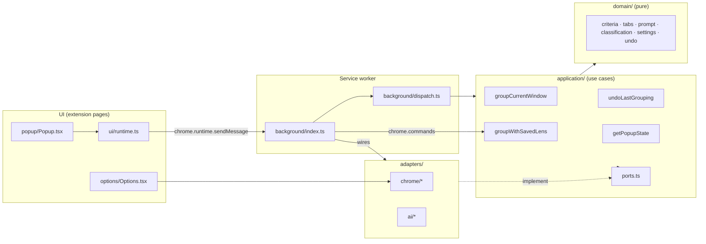
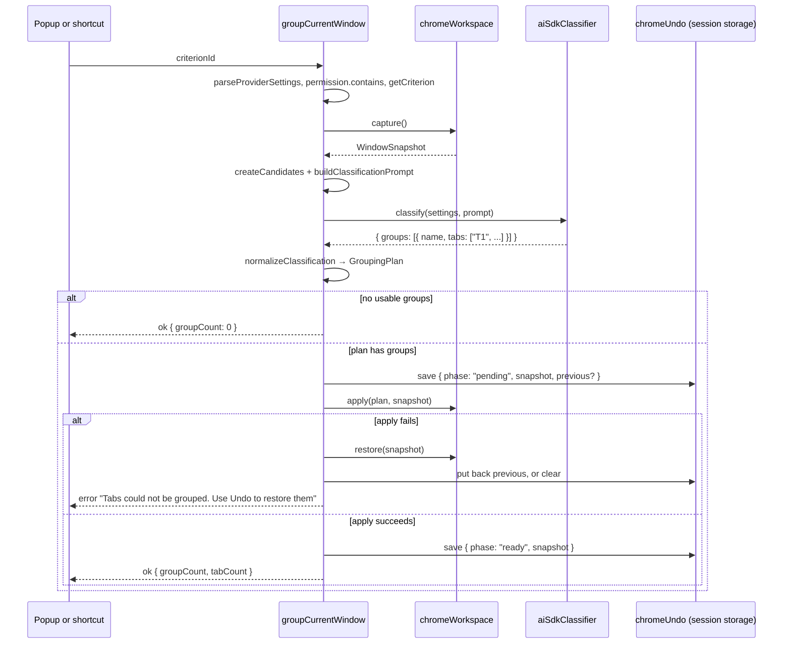
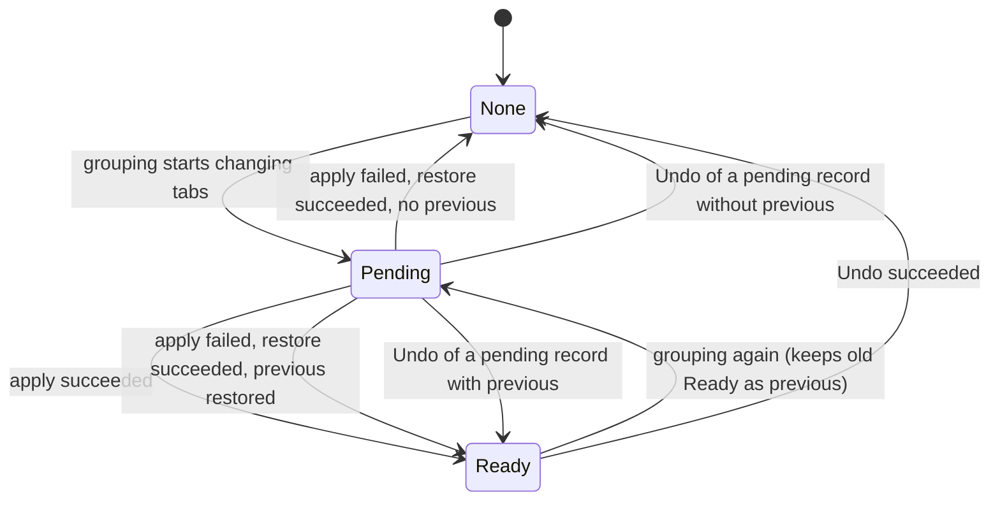
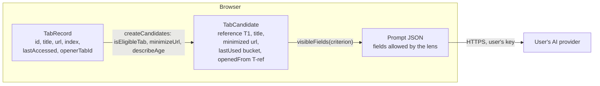

# Tab Declutter architecture

Tab Declutter is a Manifest V3 Chrome extension with no backend. A popup and a keyboard shortcut ask the service worker to group tabs. The service worker asks the user's AI provider how to group them, checks the answer, and changes the tab strip. One Undo snapshot makes every change reversible.

This guide covers what the code doesn't make obvious:

- [Layers and dependency rule](#layers-and-dependency-rule)
- [Grouping flow](#grouping-flow)
- [Undo and crash recovery](#undo-and-crash-recovery)
- [Keyboard shortcut](#keyboard-shortcut)
- [Privacy boundary](#privacy-boundary)
- [Lenses and prompts](#lenses-and-prompts)
- [Where to make common changes](#where-to-make-common-changes)

Related documents: the [privacy policy](../../docs/privacy.md), the [store publishing guide](../../docs/chrome-web-store.md), and [ADR-0001](../../docs/decisions/ADR-0001-use-ai-sdk-in-service-worker.md), which explains why the AI SDK runs inside the service worker.

## Layers and dependency rule

The code follows a functional core and imperative shell. Pure logic sits in the middle. Chrome and network effects sit at the edges.

| Layer | Folder | Rule |
| --- | --- | --- |
| Domain | `src/domain/` | Pure functions and types. No `chrome`, no network, no clock. Tests run without a browser. |
| Application | `src/application/` | Use cases. Talk to the world only through the interfaces in `ports.ts`. Tested with in-memory fakes in `application.test.ts`. |
| Adapters | `src/adapters/` | The only code that calls `chrome.*` or the AI SDK. Each implements one port. |
| Service worker | `src/background/` | Wires adapters into `AppPorts`, then routes popup messages and shortcut commands to use cases. |
| UI | `src/popup/`, `src/options/`, `src/ui/` | React. The popup never touches tabs directly. It sends messages through `ui/runtime.ts`. |

`AppPorts` has six ports: `workspace` (read, group, and restore tabs), `settings`, `undo`, `permission`, `classifier` (the AI call), and `clock`. The clock is a port so that the "last used" rounding in the Session lens stays testable.

The Options page is an exception. It reads and writes settings, and requests host permissions, directly through `adapters/chrome/chrome-storage.ts` and `chrome-permissions.ts`. Chrome only lets a page request permissions from a user gesture in that page, so this can't go through the service worker. [inferred]

### Messages between popup and service worker

`application/runtime-messages.ts` defines the only four requests, checked with Zod in `createDispatch`:

| Request | Use case |
| --- | --- |
| `get-popup-state` | `getPopupState`: configuration, lenses, selected lens, eligible tab count, and whether Undo is available |
| `select-criterion` | `settings.saveSelectedCriterion`: remembers the lens for next time and for the shortcut |
| `group-tabs` | `groupCurrentWindow` |
| `undo` | `undoLastGrouping` |

Every response is `{ ok: true, data? }` or `{ ok: false, error: { code, message } }`. Messages are always user-facing sentences, never raw provider errors.

## Grouping flow

`groupCurrentWindow` in `src/application/group-current-window.ts` is the core of the product. The popup and the shortcut both end up here.

Nothing touches a tab until the model's answer passes two checks:

1. **Schema.** The AI SDK asks for structured output against `classificationSchema`. A malformed answer becomes the `invalid-response` error.
2. **`normalizeClassification`.** It trims names, drops blank names, ignores references the model invented, assigns each tab at most once, drops groups with fewer than two tabs, and assigns colors in a fixed order.

Early exits return an error before any change. The error codes are defined in `domain/result.ts`.

| Condition | Code | Message shown |
| --- | --- | --- |
| No valid provider settings | `not-configured` | "Add a provider first" |
| Host permission missing | `permission-missing` | "Allow access to the provider in Settings" |
| Unknown lens ID | `invalid-request` | "Choose a grouping criterion" |
| Fewer than two eligible tabs | `not-enough-tabs` | "Open at least two unpinned tabs" |
| Provider rejects the key (401/403) | `provider-auth` | "Check the provider API key" |
| Provider rate limit (429) | `provider-rate-limit` | "The provider is busy. Try again shortly" |
| Network or other HTTP failure | `provider-unreachable` | "Could not reach the provider", or "The provider could not complete the request" |
| Output fails the schema | `invalid-response` | "The model did not return usable groups" |

A model answer with no usable groups isn't an error. It returns `groupCount: 0`, and the popup shows "No clear groups found. Nothing changed."

`chromeWorkspace.apply` first ungroups every affected tab that is already in a group, then creates each planned group. Before each call it re-checks which tabs still exist (`surviving`), because the user can close tabs while the model is thinking.

## Undo and crash recovery

`UndoRecord` in `application/ports.ts` has two phases:

- The record lives in `chrome.storage.session`, not in memory. Chrome can suspend the service worker at any time, and session storage survives that. It is cleared when the browser session ends.
- **Pending is written just before the first change.** If the worker dies halfway through `apply`, the pending snapshot is still there, so the popup still offers Undo. `getPopupState` reports `canUndo` whenever any record exists.
- **Keeping `previous`.** A new grouping stores the last ready snapshot as `previous`. If the new grouping fails and rolls back, the user can still undo the earlier grouping.
- **Only one level.** A successful grouping replaces the ready snapshot.
- **If restore fails during a rollback**, the pending record stays. The user gets an error, and Undo can try again.

`chromeWorkspace.restore` uses `buildRestorePlan` from `domain/undo.ts`. It ungroups the affected tabs, moves each surviving tab back to its saved index, and rebuilds each old group with its title, color, and collapsed state. Closed tabs are skipped. The result is best-effort if tabs moved or opened in the meantime.

## Keyboard shortcut

The shortcut groups tabs with the last lens the user picked, without opening the popup.

- `manifest.config.ts` declares the command `group-tabs` (from `application/commands.ts`) with the suggested key `Alt+Shift+G`. Chrome can refuse a suggested key that clashes with another extension. The popup then shows "No keyboard shortcut set." and a link to `chrome://extensions/shortcuts`.
- `background/index.ts` listens on `chrome.commands.onCommand` and calls `groupWithSavedLens`. That use case reads `settings.loadSelectedCriterion()` and calls `groupCurrentWindow`, so the shortcut has the same checks and Undo as the popup.
- The popup saves the lens with `select-criterion` whenever the user picks one. `getPopupState` falls back to `defaultCriterionId` (`project`) and saves it if the stored lens no longer exists, for example after a custom lens is deleted.

With no popup open, the toolbar badge is the only feedback. `adapters/chrome/chrome-badge.ts` handles it:

| State | Badge | Tooltip |
| --- | --- | --- |
| Working | `…` on indigo | "Tab Declutter: grouping tabs…" |
| Done | group count on green, or `0` | "Tab Declutter: made N groups" or "no clear groups found" |
| Failed | `!` on red | "Tab Declutter: " plus the error message |

The badge clears after 4 seconds using `setTimeout`. If the user presses the shortcut again within that window, the earlier timer can clear the newer badge early. [inferred]

## Privacy boundary

The only data that leaves the browser is the prompt sent to the user's provider. The domain layer builds the prompt, so the whole boundary is testable without Chrome.

Four steps narrow the data:

1. **`isEligibleTab`** drops pinned tabs and split-view tabs. They're never sent and never moved.
2. **`minimizeUrl`** keeps only origin and path. Credentials, query strings, and fragments are removed. `file:` URLs become `file://local`. Other schemes keep only the scheme.
3. **`createCandidates`** replaces Chrome tab IDs with references `T1`, `T2` and so on in window order. It rounds `lastAccessed` into coarse buckets with `describeAge` ("just now", "25 min ago", "yesterday"). It maps `openerTabId` to a `T` reference only if the opener is also eligible.
4. **`visibleFields`** in `domain/prompt.ts` is the gate. Only a criterion with `signals: 'session'` sends `lastUsed` and `openedFrom`. Every other lens, including all custom lenses, sends only `reference`, `title`, and `url`. `domain.test.ts` covers this.

Other protections:

- **Prompt injection.** The system prompt marks titles and URLs as untrusted data and tells the model to ignore instructions in them. `normalizeClassification` then ignores any reference the model invents. A hostile page title can at worst produce a bad group name, and never a change to a tab outside the window.
- **API key storage.** The key is kept in `chrome.storage.local`. `restrictLocalStorage` sets the access level to `TRUSTED_CONTEXTS`, so content scripts couldn't read it even if one were added.
- **Host permissions.** The manifest declares broad optional hosts. At runtime, Options requests only the exact origin of the configured provider, and removes the previous origin after switching.
- **Contract checks.** `scripts/verify-project.ts` runs in `bun run check`. It fails the build if source code calls `console.*`, if a string looks like a real API key, if content scripts appear, or if permissions change.

Chrome has no tab-creation time. The Session lens is therefore an approximation built from `lastAccessed` (Chrome 121 and newer), `openerTabId` (only while the opener is still open), and tab order.

## Lenses and prompts

A lens, called `Criterion` in the code, is a name, a short description for the popup, a model instruction, and a `signals` level. The built-in lenses live in `builtInCriteria` in `domain/criteria.ts`:

| ID | Name | Signals | Groups by |
| --- | --- | --- | --- |
| `project` (default) | Project | basic | the goal the tabs serve, across sites |
| `topic` | Topic | basic | subject matter |
| `session` | Session | session | when tabs were used, and which tab opened which |
| `next-step` | Next step | basic | four fixed groups: "Act now", "Read later", "Reference", "Probably done" |

Custom lenses from Options are stored as `CustomCriterion` and always get `signals: 'basic'`.

`buildClassificationPrompt` combines a shared system prompt with the lens. The system prompt holds the safety rules, a target of 3 to 7 groups, no catch-all groups, and naming rules (2 to 4 words, in the language of the tab titles). The lens part is "Grouping lens: {name}", the instruction, and the tab JSON in window order. Each lens instruction also contains its own naming rule, and a domain test enforces that.

Lens IDs were renamed in v0.2.0. The project doesn't keep backward compatibility, so a saved lens from v0.1.x that no longer exists falls back to Project.

## Where to make common changes

| Change | Start in | Also update |
| --- | --- | --- |
| Add or tune a built-in lens | `domain/criteria.ts` | `domain.test.ts` (lens list and naming rule), README lens table |
| Send a new tab signal to the model | `domain/tabs.ts` (`TabRecord`, `TabCandidate`), `adapters/chrome/chrome-workspace.ts` | `visibleFields` gate, `docs/privacy.md`, the Options privacy note, the store data disclosure |
| Add a provider | `domain/settings.ts` (`providerKinds`, default base URL), `adapters/ai/create-model.ts` | Options provider list, README provider table |
| Add a popup action | `application/runtime-messages.ts`, a new use case, `background/dispatch.ts` | `dispatch.test.ts`, `ui/runtime.ts` |
| Change shortcut feedback | `adapters/chrome/chrome-badge.ts` | |
| Change store images | `store-assets/screenshot-src.html`, `tile-src.html` | Run `store-assets/generate.sh` |
